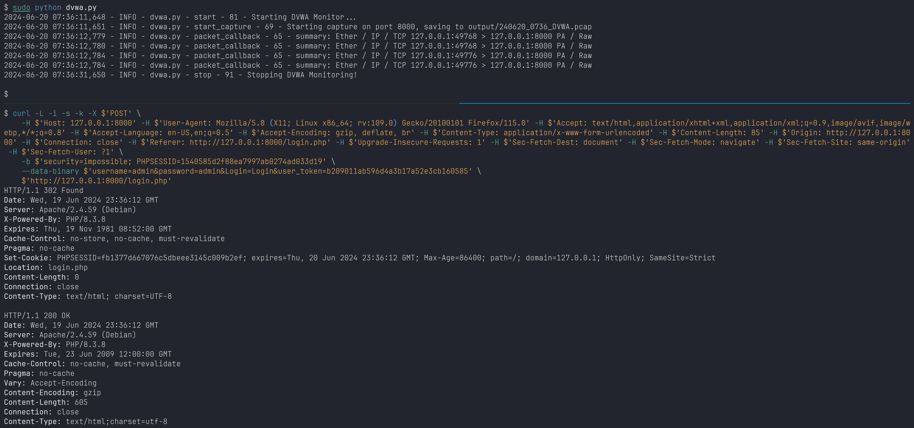
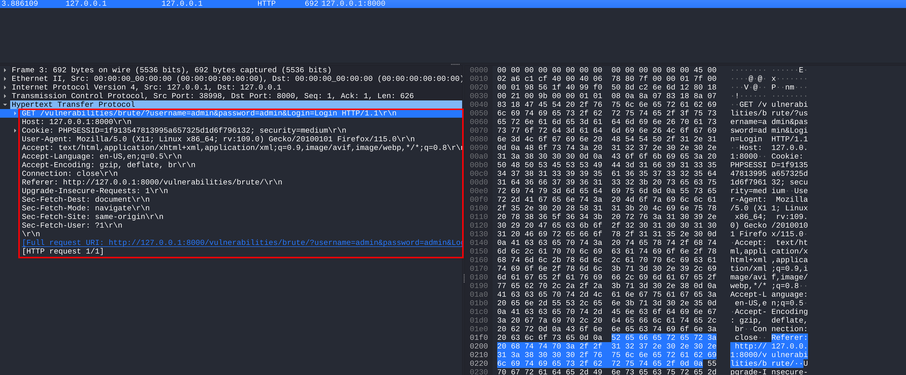
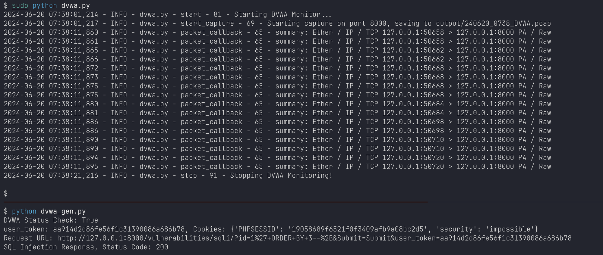

# The Intrusion Simulation System

## System Workflow


How to use simulated data?

- Train & Valid Dataset: Normal + Exploit data
- Test Dataset: Fuzz data

## Prerequisite

- Docker
- Docker Compose
- Scapy

```bash
./docker_install.sh  # only for Debian-like machines
                     # others, ..., TODO
```

## Compatible Model

- [ ] DVWA, Port8000
- [ ] VulnHub, Port8001, 8002, ...
- [ ] VulHub, Port9001, 9002, ...

## Usage

### TODO

As DVWA model as an exmaple:

```bash
./system/dvwa/start.sh
python exec.py --system dvwa --monitor --generator 'all'
python exec.py -s dvwa -m -g 'all'
python exec.py -s dvwa -m -g 'normal'
python exec.py -s dvwa -m -g 'fuzz'
python exec.py -s dvwa -m -g 'exp'
```

### Current Stage

[](https://asciinema.org/a/wfeDhk38EzVCnQKiZpePkmCHe?autoplay=1)

[](https://asciinema.org/a/AOosfNg2XshF9ztfLeLrcqW05?autoplay=1)s

```bash
python monitor/dvwa.py --range 100  # capture network for 100 seconds
python monitor/dvwa.py -r 100

python generator/dvwa_gen.py fuzz  # generate fuzz data: only for sqli section
```

The first screenshot shows that http monitor (network capturer) works fine.



The second screenshot shows the captured pcap and corresponding package.



The third screenshot shows the interaction between generator (exploit data) and monitor (collect http packages).


